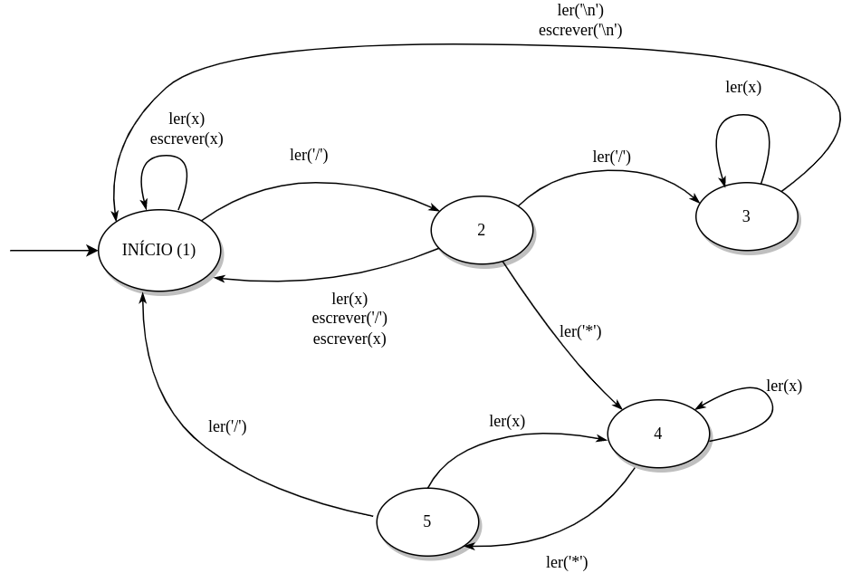

# 12-entrada-saida

Exercício para entrega. Faça nesta ordem:
- Abra o arquivo *tirar_comentarios.c* e implemente a retirada de comentários de um programa fonte em C. Lembre-se que há 2 formas de comentário:
    - "//" que indica um comentário até o fim da linha.
    - "/*  .....  */" que marca um comentário multi-linhas; qualquer coisa entre os delimitadores é ignorado.
- Observe o diagrama abaixo (uma máquina de estados). Ela especifica todo o passo-a-passo que o algoritmo deve dar a cada momento (estado). São 5 estados possíveis e as setas indicam as mudanças de estado, ocorridas devido a alguma entrada ocorrida.



- Atividade do final da aula 16 https://insper.github.io/SistemasHardwareSoftware/aulas/16-entrada-saida/
- Prazo: https://insper.github.io/SistemasHardwareSoftware/sobre/

- Confira erros de memória com `valgrind --leak-check=yes ./tirar_comentarios`

- A execução de seu programa deve ser algo como: `./tirar_comentarios caso1.c resp_caso1.c`, ou seja, o primeiro parâmetro a ser passado para o seu programa é o arquivo com comentários, e o segundo, o arquivo-resposta que será gerado pelo seu programa.

- Teste executando:
```
./teste.sh
```
- Para entregar a atividade, envie para o github suas alterações e suba uma tag com o padrão de nomenclatura `atv12.x.y`, substituindo `x` e `y` por qualquer número inteiro! Ex:

```
git tag -a atv12.0.0 -m "enviando a atv12.0.0"
git push origin atv12.0.0
```
